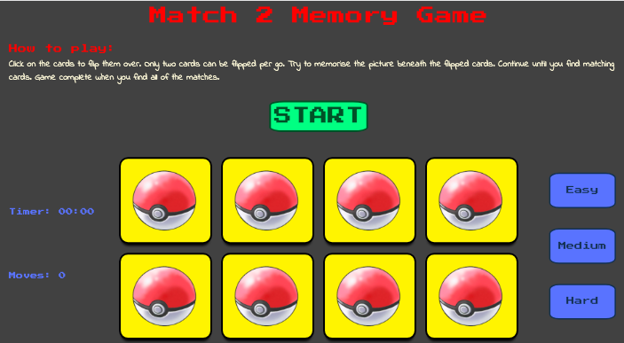
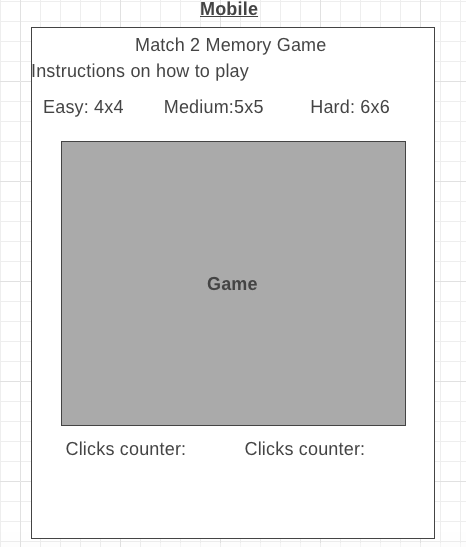
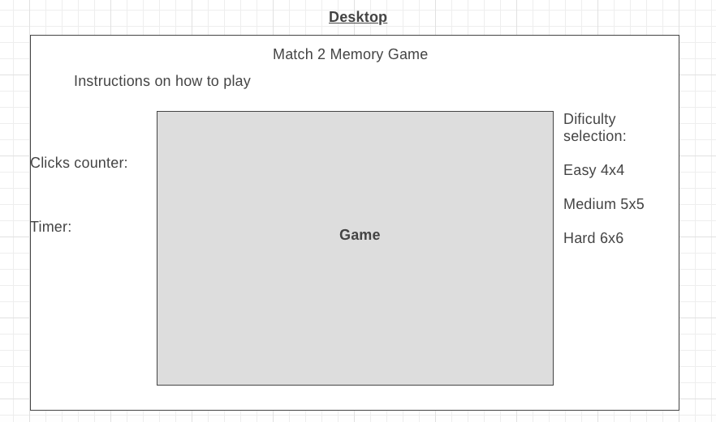

# Match 2 Memory Game

## Aim

This website has been created for my second milestone project with Code Institute, my Interactive Front End Development project. The aim of the project is to build a memory game in which a deck of cards is shuffled, where only two cards will have the same image, placed face down and then flipped over two at a time to find the matching cards. The game ends when all of the matching cards have been found. 
The game, varibale and functions, is written with JavaScript and jQuery and the website is built and styled using HTML and CSS.

## Initial Stages
1. Wireframes

I made two wireframes for how I would like the website to look. One wireframe for the layout on a desktop, and one wireframe for the layout on a mobile device/tablet. 

Wireframes created with [wireframe.cc](https://wireframe.cc/).

2. Game Breakdown

I then began to think about how the game is played, from the first step to the last, and how I could then write this in terms of JavaScript functions.
- Deck of cards required, each with their own ID number to identify them.
- For every card there must be a matching card. These cards need something to distinguish them as matching.
- The cards must be randomly shuffled when the game starts.
- The cards must be flipped on click.
- Determine whether the cards match or not
    - If the cards match, they disappear.
    - If the cards don't match, they flip back over.
- When all of the matched cards have been found, a congratulations modal appears.

## Features

1. Start Button

Shuffles the deck of cards, starts the timer, adds event listeners to each card so when one is clicked the moves taken goes up by one, allows cards to be clicked. 

2. Reset Button

Disables cards being clicked. Flips any flipped cards back over. Sets the timer and the moves taken to 0. Shows a reset message, stating successful reset of game.

3. Timer

Starts counting after the start button has been clicked. Counts up in seconds and minutes. Stops when the game is reset or complete.

4. Moves Taken

Counts the number of times the user has clicked on the cards. Stops when with game is reset or complete.

5. Difficulty buttons

Allows the user to decide the difficulty of the game. Easy difficulty is the initial difficulty level, with 8 cards to match. Medium difficulty level increases the number of cards to match to 12. Hard difficulty level increased the number of cards to match to 18. Clicking these buttons adds/removes the appropriate number of cards and resets the game ready for the user to click start again to begin. 

6. Sounds

Sounds included for whether the user is successful or not in finding two matching cards. 

7. Congratulations Modal

Pop-up modal activated when all of the matched cards have been found by the user. The modal states the time and number of moves taken to complete the game, with the option to play again.

## Technologies Used

1. HTML5

2. CSS

3. JavaScript

4. [jQuery v3.3.1](https://jquery.com/)

 - Used in every function for selecting elements.

5. Flexbox

 - Used alongside Bootstrap for the layout of the website and importantly the deck of cards. With Flexbox I could organise the number of cards with different difficulty levels much more efficiently, allowing me to choose the number of cards in a row to ensure all cards would be on screen whilst the user is playing. 

 6. [Bootstrap v4.4.1](https://getbootstrap.com/)

  - Used alongside Flexbos for the layout of the website. In particular, using rows and columns to ensure limited blank space on different sized screens. For example, on a desktop there is a column on the left with the Timer and Moves Taken counters, in the centre is the game and on the right are the difficulty level buttons. On a tablet/mobile, the counters and buttons are in rows above the game to allow the game to fill the width of the screen. 

  7. [Animate.css](https://daneden.github.io/animate.css/)

   - Used to animate the cards for a correct or incorrect match, and animate the reset message to slide in and slide out. 

   8. [Google Fonts](https://fonts.google.com/)

   9. [Favicon.io](https://favicon.io/)
   
   10. Chrome Developer Tools

   - Used for debugging, live-testing, styling and responsiveness.

   12. [Visual Studio Code](https://code.visualstudio.com/)

   - Used as the editor for the project.

## Content

### script.js

I began the file by defining some variables and constants. I tried to write the code in the order in with the game would use the functions. After some refactoring, breaking and rebuilding the code, I found this was not the best approach to writing the functions.

For example, the first function I added was the `shuffleDeck()` function (Credit: https://jsfiddle.net/C6LPY/2/), then `chooseCards()`, `checkMatch()`, `cardMatch()` and `cardUnmatch()`. I then added the `startGame()` function, which called to all of the above mentioned functions. When I added the reset button, I also added the `resetGame()` function. Both the `resetGame()` function and `startGame()` had some repitition, which prompted me to write a `setToZero()` function which contained the repetitive code.

 A similar situation occurred when writing the `easy()`, `medium()`, and `hard()` functions, so I added the `difficultyReset()` function which could be called to for each of the difficulty choice functions. 

 After writing the `timer()` function, I researched whether there was a more elegant way of writing this code and found that using `setInterval()` is not the most accurate way of counting in seconds. However, I felt that the code I'd written was easy to follow and understand, so I didn't change it at the expense of inaccuracy. 

 ## Testing

 The project was tested throughout using Chrome Developer Tools. I used Chrome Developer Tools to catch bugs in my code; most commonly stray punctuation, and for example using console.log() to check that the deck of cards was shuffled correctly.
 
  It also allowed me to check that classes were being added to the cards at the correct times (and similarly being removed when needed). To ensure the game played correctly.

  I also used the element style sections in particular to make any alterations to the layout before changing my style.css file. Furthermore, Developer Tools was used when designing the website for different viewport sizes, ensuring the design was responsive for all available virtual devices. 

  Additionally, the deployed version has been tested on MacBook and iPhone X.

  In testing the game functionality, it has been played many times by myself on all 3 difficulty modes and multiple other times by other users to help inform me of any bugs or errors that occurred. 

  The timer was also tested by starting the game and leaving the webpage open for around 30 minutes, to ensure it would correctly show the time up for as long as a user was playing. 

## Issues Encountered

The first difficult problem I encountered was figuring out how to check if two cards were matching, especially when extra cards were going to be added for different difficulty levels. After some research I found a YouTube video (https://www.youtube.com/watch?v=Eq4bUSWGv1Y) which introduced me to `data-` attributes. This enabled me to check if two selected cards (with class `.flipped`) had the same `data-` attribute and were therefore matching. 

A second problem I encountered was that initially I called the `timer()` and `moveCounter()` function inside my `startGame()` function. This meant that every time the user clicked the start button, `timer()` and `moveCounter()` were called again and again. This meant that for every second, the timer was counting up in 2's, 3's, or 4's etc depending on the number of times the start button was clicked. Similarly, the moves taken was also counting up in 2's, 3's, or 4's etc. After researching other timer functins and match 2 games, I found a blog post (Credit: https://scotch.io/tutorials/how-to-build-a-memory-matching-game-in-javascript) that used the `clearInterval()` function whenever the timer was stopped. After implementing this my timer problem was fixed. This blog post also helped me fix my `moveCounter()` problem by explaining the use of `addEventListener('click', moveCounter)` where I could add the event listener to each card on `startGame()` and `removeEventListener('click', moveCounter)` on `resetGame()`, to stop the function being called over again. 

A regular problem I encountered was ensuring all of the game cards were visible at each difficulty level on different viewport widths. This problem was resolved with the use of Flexbox, Chrome Developer Tools and media queries. 

An issue I have yet to fix is that some of the cards (divs) expand when they are flipped to reveal the image on the other side. If I was to have more time working on the project I would like to fix this. 

## Deployment

Deployed via GitHub Pages (https://arcorco.github.io/ife-milestone/)

## Credits

Images: (https://pokemondb.net/), (https://icon-icons.com/icon/pokeball-pokemon-pokeball/67448) 

Sounds: (http://www.orangefreesounds.com/wrong-answer-sound-effect/), (http://soundbible.com/1003-Ta-Da.html)
